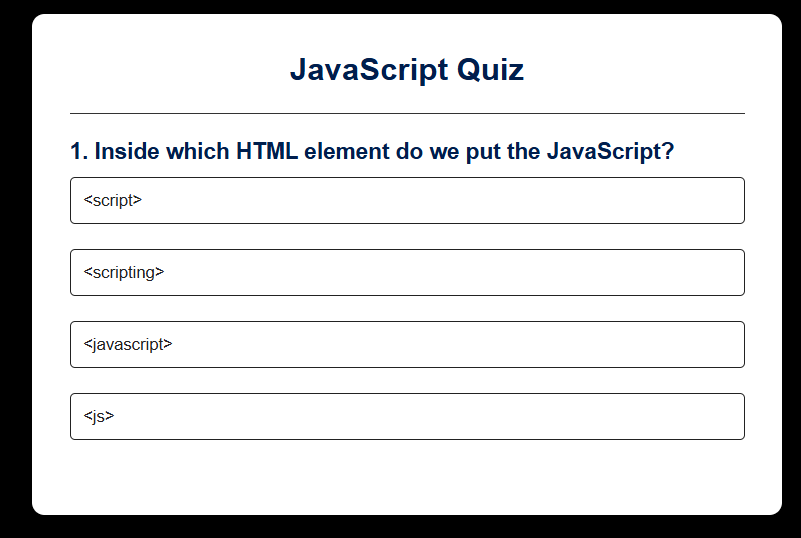

QuizApp 🧠✨

A simple and interactive quiz application built with HTML, CSS, and JavaScript. Users can test their knowledge, get instant results, and track their score.

🚀 Features

🎯 Multiple-choice questions

⏱️ Timer for each quiz round (if implemented)

📊 Instant scoring system

🔄 Option to restart the quiz

📱 Fully responsive design

🛠️ Tech Stack

HTML5 – structure

CSS3 – styling and layout

JavaScript (ES6+) – logic and interactivity

📂 Project Setup

Clone or download this repository:
https://github.com/dipak0304/QuizzApp

Open the project folder and simply run the index.html file in your browser.

No server setup required 🚀

🖼️ Screenshots
  

🤝 Contributing

Contributions, issues, and feature requests are welcome!
Feel free to fork this repo and submit pull requests.
